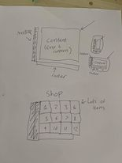
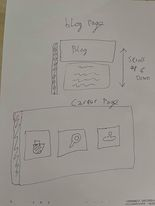
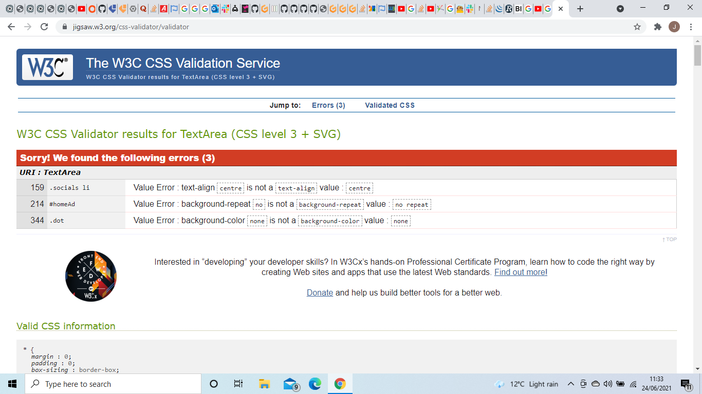

# R8 Rebotics
This is a website designed for a Company called R8 Robotics. It will be disigned to:
1. spread awareness of their brand
2. spread awareness to their social media
3. Allow them to sell products
4. potentially employ only professionals
---
# UX(User Experience)
I need to create a positive user experience. I will achieve this by not overloading the user with infomation, using relevant colours and creating a simple yet exciting layout. I will not include annoying pop-ups or any autoplay.
## Strategy plane
### user stories
I'm looking for machines to increase efficiency within my company. I do not wish to waste any of my valuable time- Boris:32
I havnt the slightest clue what robots are up to these days, I wonder what theyre up to-Maggie:75
You know dialogue is actually harder to write than I wouldve thought-Jordan:20
I've Just recently graduated from a university and im looking for a job in the robotics feild. I need to find places to apply and to know if my qualifications are good enough- Harry:21
### conclusion
My site I will build must:
* Be Welcoming and not alarming as robots sometimes can have a bad reputation
* Educate people on the company and robotics in general
* Show a large array of products
* advertise oppertunities for employment
## Scope plane
Site will contain 5 pages
1. Home
2. Shop
3. Blog
4. careers
5. 404 page(for errors)

Users can access them using a navigation bar. Users can interact with the web pages, creating more depth within a page allow more info and creativity to be displayed.
## Structure plane
* Each page will share a background, footer, header and navbar for simplicity/consisty/ease of access
* Each page will be responsive for multi-device usability
The Navbar will always be visible but will not take up alot of room. it will display information navigation in order of importance
1. Home - First impressions are mode, dont overload with information. Explains Who they are and what they can offer you
2. shop - The company needs to make money and show off what they have to offer, two buttons on the first page lead here as it is the next step. viewers need to see lots of products with little obstructions.
3. blog - If people are unsure about buying or are just interested they can read articles on relavent topics
4. careers - less of a prioity as the people pool is smaller and those people likely are seeking this page out. offers information on available positions and requirements to give people oppurtunities and to help the company bring on new, informed and qualified people

1. settings - allow the user to customize their expirience, enlarging text can help people who struggle to see or strain their eyes whilst on a computer
2. socials - help promote the companys social media
## Skeleton plane
I will create a Skeleton/diagram of my pages before I code them.

## Surface plane
### colours
The colors while be bright and friendly and fit a robotic theme. if we give off an intimidating vibe then people will not wont to purchase a robot. Bright colors have a chance to cause irritation potentially at night therefore a night mode will be implimented
### backgrounds

The background is an opportunity to show of the products and how/where they are effective
If the image fails to load the light grey color would have to do.
### other
* font-family; font can be customized with a range from standard to whacky
* Font icons from fontAwesome will be used as the social media icons are instantly recognized and conveys information quickly
* Images will need to have a good resolusion as bad quality images are unpleasent and give a bad impression of the quality the company can provide
---
#Features
* Navigation bar to easily access each page
* Overlay when hovering on some images to display extra relavent information
* slideshow images
* customisable text
* night mode
* Site will structure can change depending on screen size
---
# Technologies used
* html-structure of the page
* css-styling of the page
* Javascript- create an interactive expirience.
* JQuery- makes coding time with javascript more efficient
* FontAwesome-used to display icons
* GoogleFonts-used for text styling
* replit-used for proto-types and Testing
* git-version control
* gitpod-creating files and writing code
* github-storing the collective files
* dev-tools- testing(especially with functions)
---
# testing
.png)
temporary borders were used to visually test where things were positioning and to aid me in building the site
.png)
I found a bug that if you make an object invisible using opacity then the button were still clickable, so i had to switch to display:none
.png)
.png)
I would use dev tools both to see how the site looked with different formats/screen sizes but also to check for error. Additionally i was using the console to call functions so i didnt have to create accounts or log in to call them
## Post completion Testing
* Clicked on every link combination on the navbar to ensure every page had all working internal links
* tested on multiple screen sizes
* tested on multiple browsers
* Tested screen responsivness on Moto G4, Galaxy S5, Pixel 2, Pixel 2 XL, Iphone 5/SE, Iphone 6/7/8, Iphone 6/7/8 plus, Iphone X, Ipad, Ipad pro, Surface Duo and Galaxy fold using dev tools on chrome.
* had a friend use the site
## Unfixed bugs/Things that could be better
* blog section has very messy code and doesnt wor as well as i wanted
* Footer wasnt utilized
* sign in/up doesnt clear its input when the window is closed
* math question only plays it display animation once
## Validater

I had my css code validated here:
I had all my html code validated here:
I had all my JavaScript validated here:![https://beautifytools.com/javascript-validator.php]
I corrected all errors/mistakes. Now all code is valid
---
# Deployment
I wrote the code in gitpod and committed frequently and pushed it to github(cloud)
I then used gitpages to deploy the page.
---

